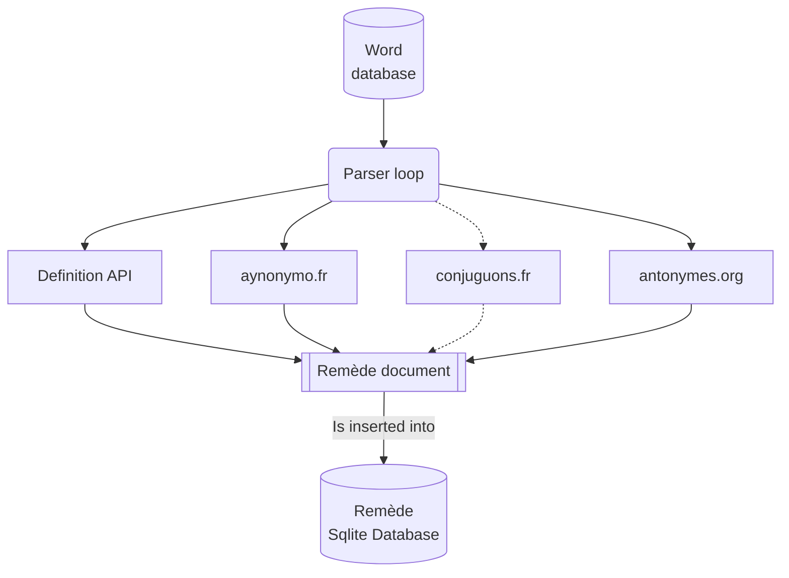

# The building lifecycle
A Remède database generation can take a while... Let's see what happend step by step in the generation. 
{: .fs-6 .fw-300 }

## What is a Remède database generation

When you generate a new fresh Remède database, you build an **Sqlite database** which includes **all the dictionary's words**, and their metadata, stored in a JSON format, specified as [the Remède document format](/docs/database/schema).

## Generate the database step by step
Learn how to generate Remède database by yourself.
{: .fs-3 .fw-300 }

Generation used to require to execute a lot of python scripts. But now, only two steps are required to generate a database.

1. `pre_generate_ressources.py` generate multiple useful resources (`mots.txt` and `ipa.json`, from `IPA.txt`); see [Dataset](https://docs.remede.camarm.fr/docs/database/dataset)
2. `generate.py` generate the **Sqlite database** which contains all the [Remède documents](https://docs.remede.camarm.fr/docs/database/schema) for each letter of the alphabet (see [generate.py](#generatepy))

{: .important }
> All the scripts are stored in `scripts` folder and must be executed from **project root**. 

## generate.py
A script to iterate words and build their Remède document.
{: .fs-3 .fw-300 }

**How it works ?**
1. It iterates over 1 000 000 words (from `data/mots.txt`)
2. For each word, it retrieves its definition using [`api-definition`](#api-définition) and more information with extern services...
3. It generates its [Remède document](https://docs.remede.camarm.fr/docs/database/schema)
4. It inserts into the Sqlite database: the word, its sanitized form, its phoneme, its `JSON` format (and more metadata required for powerful and advanced features)

_A lifecycle schema of `parse.py`_
