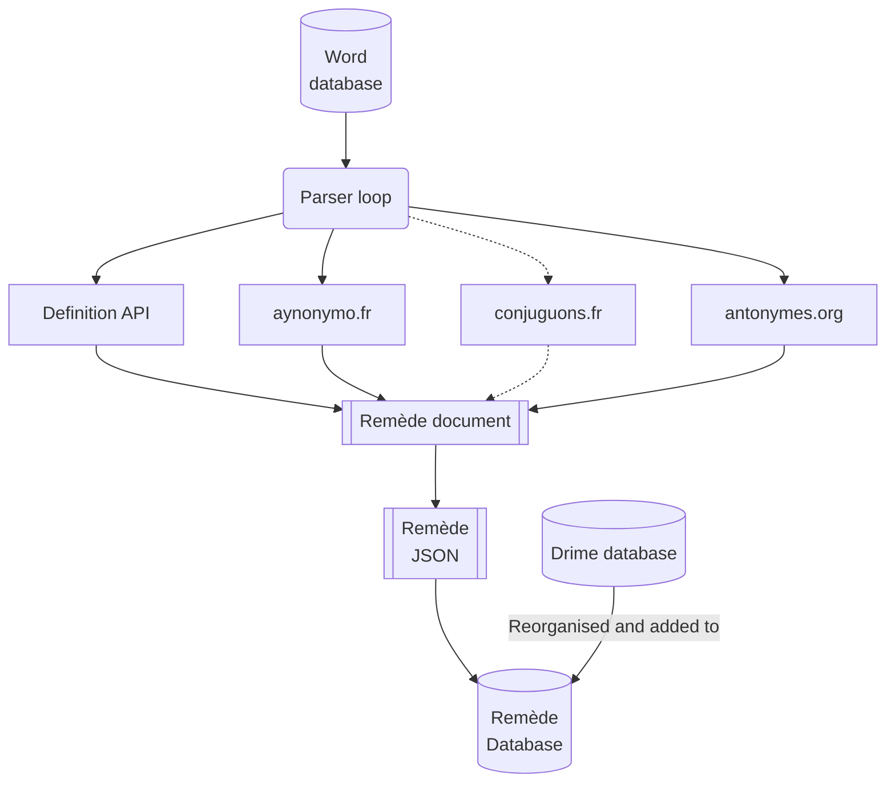

# The building lifecycle
A Remède database generation can take a while... Let's see what happend step by step in the generation. 
{: .fs-6 .fw-300 }

## What is a Remède database generation

When you generate a new fresh Remède database, you build **JSON files** for each letter (`data/REMEDE_a.json`) but also
the **Sqlite database** (`data/remede.db`).

## Generate the database step by step
Learn how to generate Remède database by yourself.
{: .fs-3 .fw-300 }

Generation require to execute multiple python scripts...

0. `pre_generate_ressources.py` generate multiple useful resources (`mots.txt` and `ipa.json`, from `IPA.txt`); see [Dataset](https://docs.remede.camarm.fr/docs/database/dataset)
1. `parse.py` generate a **JSON file** which contains all the [Remède documents](https://docs.remede.camarm.fr/docs/database/schema) for each letter of the alphabet (see [parse.py](#parsepy))
2. `generate_sqlite.py` generate the **Sqlite database**, from the previously generated JSON files
3. `generate_index.py` generate the **wordlist** table (an index table) and push it to the Sqlite database
4. `build_rimes.py` add the rimes to the dictionary (see [Rimes](https://docs.remede.camarm.fr/docs/database/rimes))

{: .important }
> All the scripts are stored in `scripts` folder and must be executed from **project root**. 

## parse.py
A script to iterate words and build their Remède document.
{: .fs-3 .fw-300 }

**How it works ?**
1. It iterates over 250 000 words (from `data/mots.txt`)
2. For each word, it retrieves its definition using [`api-definition`](#api-définition) and more information with extern services...
3. It generates its [Remède document](https://docs.remede.camarm.fr/docs/database/schema)
4. It saves it under `JSON` format

_A lifecycle schema of `parse.py`_
